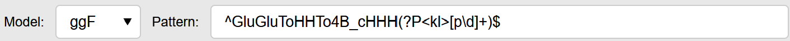
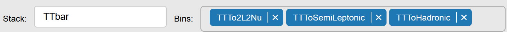
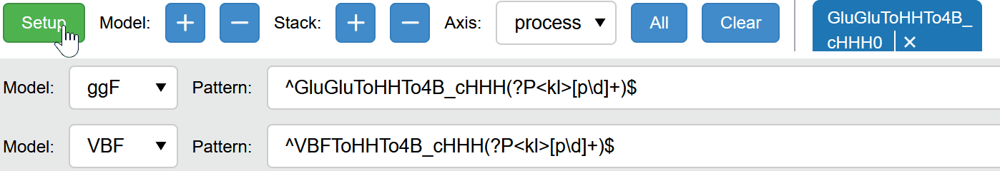
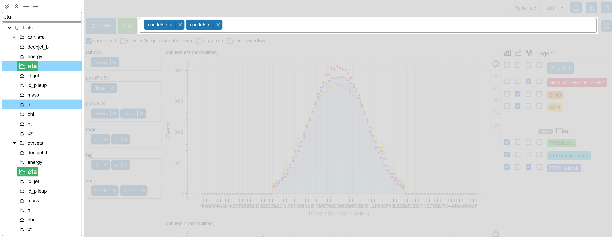
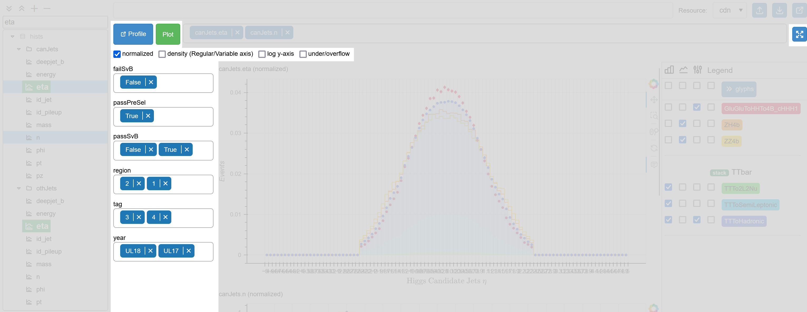
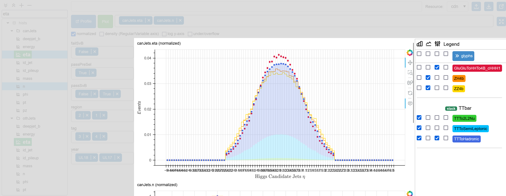
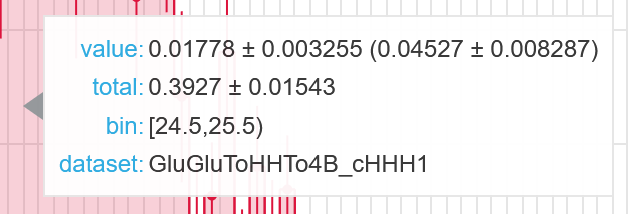
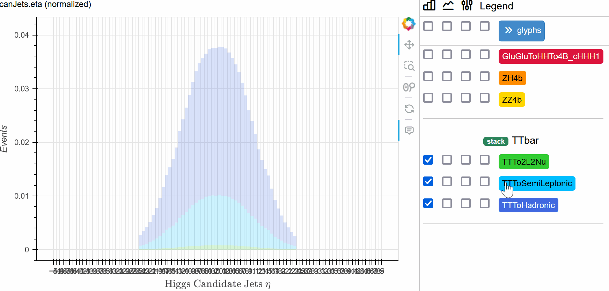
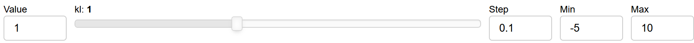

# iκ

A general-purpose plotting tool.

Suitable for:

- making interactive plots for coupling scan.
- checking a small subset of hists out of a large collection.
- exploring different binning, categorization, styling, etc.
- accessing the raw data.

**Not** compatible with:

- bulk production.
- generating publication-quality plots.
- command-line only environment.

## Getting started

1. Install the dependencies from `env.yml`.
2. Run `python -m analysis.tools.ikappa -p PORT`. (default port is 10200)
3. Open `http://localhost:PORT`.

## User guide

### Load data


From left to right:

- New: overwrite the loaded data. (hists and profiles are treated separately)
- Add: extend the loaded data
  - if no data is loaded, it behaves the same as New.
  - the categories of the extended hists must match the existing ones.
- Files: input the file paths.
  - `.yml` and `.json` are treated as profiles and the rest as hists.
  - support XRootD paths (e.g. `root://host//path/to/file`).
  - completion only works for local paths.
  - the relative paths are resolved from the current working directory of the server.
- Compression: the compression method used to load the pickled hists.
- Status: check the loaded hists and profiles.

#### Formats

- **Hists**: a pickled dictionary with at least the following keys:

```python
{
    'hists': dict[str, Hist], # histogram data 
    'categories': set[str], # name of category axes
}
```

The category axes in all hists must be the same (both the name and the order of bins). Otherwise, it will try to find the most common binning and drop the unmatched hists. [A tool](#group-hists-by-category) is provided to group the hists by category axes.

- **Profiles**: a json or yaml file with a list of dictionaries in the following format:

```yaml
name: str 
# [required]
# a regex expression to match the name of the hists

rebin: int | list[int]
# [style] [optional]
# rebinning factor
```

If multiple profiles match the same hist, the `[style]` appear in the later ones will override the previous ones.

### Setup

When a hist file is loaded, a default setup is generated based on the categories and [config](#config).


From left to right:

- Setup(Unset): switch between frozen and unfrozen mode.
  - click the `Setup` to freeze the setting and make [Plot](#plot) available.
  - click the `Unset` to unfreeze the setting and make [Setup](#setup) available again.
- Model: add a [kappa framework](../../../base_class/physics/kappa_framework.py) model.

  - **Model:** the name of the model class.
  - only [di higgs](../../../base_class/physics/di_higgs.py) is available now.
  - **Pattern:** a regex pattern to match the bins.
  - in the groupdict generated by the pattern, the keys should be the name of the corresponding coupling in the model, and the values should be possible to be converted to floats. (chars other than digits will be interpreted as decimal points e.g. `2p45`=>`2.45`)
- Stack: create a histogram stack.

  - **Stack:** the name of the stack
  - only used in the legend so it can be anything.
  - **Bins:** the bins to stack.
- Axis: select the axis to compare.
  - only `StrCategory` is supported.
  - each bin in the chosen axis will be plotted separately.
  - if matched, the bin will be used in the corresponding model or stack.
- All: select all bins.
- Clear: clear selected bins.
- A multichoice input to select the bins.

#### Match


The models and stacks will try to match the bins when the setup is frozen. If matched, a dropdown listing all matched bins is available when clicking the green `Matched` button. If not matched, the model or stack will be ignored during the plotting.

### Plot

The plotting panel is available when the [Setup](#setup) is frozen.

#### Select hists


From left to right:

- A tree view listing all loaded hists.
  - `.` in the hist names are treated as path separators. (see `UI.path_separator` in [config](#config))
  -  for 1D hists and  for 2D hists.
  - support click, shift-click and ctrl-click to select hists.
  - from top to bottom:
    - expand/collapse/select/deselect all.
    - search node
    - tree view
- A multichoice input to select the hists.
  - the search is based on the full hist name.

#### Options


From top to bottom, left to right:

- Profile: list matched profiles for the selected hists.
- Plot: generate the plot for all selected hists.
- Rightmost button: make the [Plot](#plot) section fullscreen.
- Plotting options:
  - **normalized**: `bin[i]=>bin[i]/sum(bin)`
  - **density**: `bin[i]=>bin[i]/bin_width[i]` (only for `Regular`/`Variable` axes)
  - **log y-axis**: make the y-axis logarithmic where the bottom is set to be the smallest positive bin round-down to the nearest power of 10.
  - **under/overflow**: include the underflow and overflow bins in the plot and the normalization.
- Category multichoice: select one or more bins from each category other than the one used in the [Setup](#setup).
  - the hist is sliced and summed over all selected bins.
  - the overflow bin in `IntCategory` or `StrCategory` is labeled as ***`Others`***.

#### Interactive plot



From left to right:

- A list of plots:
  - for stack plots, the errorbar is the sum of the errors in quadrature for the top stack and zero for the rest.
  - a tooltip is available when hovering over the filled area.  
    
    - **value:** the raw bin value (and the actual bin value in the plot if **normalized** or **density** is checked)
    - **total:** summed over all bins (including the flow bins if **under/overflow** is checked)
    - **bin:** edge or category name
    - **dataset:** the bin name from the category selected in [Setup](#setup) (or the pattern if it is generated by a model)
  - see [Bokeh plot tools](https://docs.bokeh.org/en/latest/docs/user_guide/interaction/tools.html) for the buttons located at the top right corner of the plot.
- Legend and controls:
  - glyph: expand/collapse the glyph control panel.
    - each glyph can be shown/hidden individually.
    -  fill, step, errorbar
    - for stack plots, the stack can be temporarily removed by clicking the name
      - the normalization is unchanged.
      - the errorbar will be transferred to the next stack if the top one is removed.
    
- Coupling slider: adjust the coupling values.
  - only available when at least one model is rendered.
  
  - **Value**: directly input the value
  - the name of the coupling and a slider to adjust the value.
  - **Step**: step of the slider
  - **Min/Max**: the range of allowed values

### Share

The rendered plots can be saved as a standalone html file.


From left to right:

- The path to upload the html file.
  - support XRootD paths.
- **Resource:** select how the bokeh library is loaded.
  - **cdn**: from the CDN. (recommended, will generate a much smaller file)
  - **inline**: embed in the html.
- Upload: upload to the specified path.
- Download: download directly from browser.
- Preview: open in a new tab.

## Tools

### Group hists by category

Group the hists based on category axes and save in separate files.

```console
python -m analysis.tools.ikappa.group_hists_by_category [-h] -i INPUT -o OUTPUT

options:
  -h, --help            show this help message and exit
  -i INPUT, --input INPUT
                        path to the input hist file (default: None)
  -o OUTPUT, --output OUTPUT
                        path to the output hist file (default: None)
```

### Copy data to multijet

Since, the reweighted 3b data are treated as 4b multijet background model, to make it compatible with the plotting tool, the hists under `{process: data, ntag: 3}` need to be copied to `{process: QCD Multijet, ntag: 4}`.

```console
python -m analysis.tools.ikappa.data_to_multijet [-h] -i INPUT_FILES [INPUT_FILES ...] [-o OUTPUT_PATTERN] [-d DATA_PROCESS] [-mj MULTIJET_PROCESS] [--process-axis PROCESS_AXIS]
                           [--tag-axis TAG_AXIS]

options:
  -h, --help            show this help message and exit
  -i INPUT_FILES [INPUT_FILES ...], --input-files INPUT_FILES [INPUT_FILES ...]
                        path to input hist files (default: [])
  -o OUTPUT_PATTERN, --output-pattern OUTPUT_PATTERN
                        output path pattern (see documentation for path_from_pattern) (default: {host}{parent1}/{name}_mj.{ext})
  -d DATA_PROCESS, --data-process DATA_PROCESS
                        name of input data process (default: data)
  -mj MULTIJET_PROCESS, --multijet-process MULTIJET_PROCESS
                        name of input multijet process (default: QCD Multijet)
  --process-axis PROCESS_AXIS
                        name of process axis (default: process)
  --tag-axis TAG_AXIS   name of tag axis (default: tag)
```

## Tips

- Buttons with  may require the permission to open pop-up windows.
- In general, a grid certificate is required to access the files via XRootD.
- `coffea.util.save` use `lz4` to compress the pickled file.

## Config

A global [config file](config.py) is used to maintain constants, default values and styles.

## TODO

- add ratio plot and update readme
